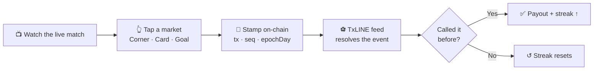

<div align="center">

# ⚡ Called It

### Prove you called it *first*.

A live, on-chain-verified football prediction game for the **FIFA World Cup 2026**.
Commit a call **before** it happens — it gets stamped on Solana — and settlement proves you were first. Nobody can fake a past prediction.

<br/>

<p align="center">
  
  
  
  
</p>
<p align="center">
  
  
  
  
  
</p>
<p align="center">
  
  
  
</p>

</div>

---

## 🎯 What it is

Every other fan app is a live scoreboard with reactions — all of which work **without** a blockchain, so they never actually prove anything. **Called It** makes the tamper-evident on-chain timestamp *the product*:

> You tap a prediction (**next Corner? Card? Goal?**) **before** it happens. The commitment is stamped on-chain the instant you tap — transaction hash, timestamp, `seq`, `epochDay`. When the event resolves through the **TxODDS TxLINE** feed (itself anchored on Solana), a settlement predicate compares the two timestamps and **proves you called it first**.

It's the one design where removing the on-chain layer *breaks* the product. Skill, not luck — whoever reads the game better earns more.

Built for the **Superteam × TxODDS World Cup Hackathon → Consumer & Fan Experiences** track (also fits Prediction Markets).



---

## ✨ Features

- **Commit-before-reveal predictions** — stamped on-chain with `seq` + `epochDay` derived from the proof timestamp (never `Date.now()`).
- **Instant settlement** — resolves the moment the event fires; payout lands immediately.
- **Skill streaks** — consecutive wins raise the multiplier (3 → 1.5×, 5 → 2×); a loss resets it. The anti-*tigrinho*: adrenaline without rigged RNG.
- **Provable track record** — an unforgeable prediction history drives accuracy, rank, and a global leaderboard. Impossible to fake a good record.
- **Wallet & on/off-ramp** — balance in SOL with a local-fiat view; cash out (SOL → BRL via PIX) and add funds, with a typed activity feed.
- **Upcoming matches** — a compact calendar of the next 5 World Cup fixtures with live countdowns.
- **Live win-probability** — a clean `Pct` meter derived from the real market (house margin removed).
- **Mobile-first PWA** — installable, dark "Stadium Pulse" theme, one-handed.

---

## 🔐 Provability model (the hard constraint)

TxLINE ships **two layers**, and confusing them is what kills projects on demo day:

| Layer | Content | On-chain provable? |
| --- | --- | --- |
| **Rich feed** | goal author, minute, VAR, foul type, `Pct` | ❌ UI / narration only |
| **Merkle (8 keys)** | goals, yellow, red, corners — per team, per period | ✅ proven by `stat-validation-v3` |

| UI market | Backed by | Provable |
| --- | --- | --- |
| **Goal** | keys 1 / 2 | ✅ |
| **Card** | keys 3–6 | ✅ |
| **Corner** | keys 7 / 8 | ✅ |
| **Foul** | rich feed only | ❌ *(for-fun market, never routed to settlement)* |

**Golden rule: prove the result, narrate the rest.**

---

## 🧱 Tech stack

| Layer | Choice |
| --- | --- |
| **Framework** | React 19 + TypeScript 7 (strict, no `any`) |
| **Build / dev** | Vite 7, PWA via `vite-plugin-pwa` |
| **Styling** | Tailwind CSS 4 + shadcn/ui (themed to brand tokens) |
| **Server state** | TanStack **React Query** (feed polling, mutations) |
| **Session state** | **Zustand** (wallet, streak, selection) |
| **Boundaries** | **Zod** schemas validate every API response |
| **Mocked backend** | **MSW** — deterministic match engine + on-chain settlement simulation |
| **Testing** | Vitest |
| **Package manager** | pnpm |

---

## 🏛️ Architecture — real domain, mocked network

The domain is **production-shaped**: transaction building, PDA / `seq` / `epochDay` handling, the wallet adapter, and the settlement predicate are all real. **MSW stands in only at the network boundary** (the TxLINE feed + Solana RPC) — it never fakes the domain. When the real backend lands, you swap MSW for it at a single seam (`src/shared/api`) with zero UI changes.

**Feature-Sliced Design** — imports only ever point *downward*:

```
src/
├── app/        → router, layout, bottom nav, wallet guard
├── pages/      → screens (onboarding, live-match, wallet, matches, profile, leaderboard, history)
├── widgets/    → composed UI (match header, prediction board, on-chain seal, countdown ring…)
├── features/   → use-cases (connect-wallet, make-prediction, resolve-prediction, wallet, fixtures)
├── entities/   → domain models (match, prediction, wallet, fixture) + payout/settlement math
├── shared/     → ui (shadcn), lib (format, cn), api (typed client + Zod)
├── store/      → Zustand session
└── mocks/      → MSW handlers + deterministic match engine + on-chain sim
```

- **Chain-agnostic wallet** — a `WalletAdapter` interface: **Phantom (Solana)** primary, **MetaMask (EVM)** ready.
- **One network seam** — all I/O lives in `shared/api` + `mocks`. No scattered `fetch`.

---

## 🚀 Getting started

```bash
pnpm install
pnpm dev          # → http://localhost:5173
```

| Script | Does |
| --- | --- |
| `pnpm dev` | Vite dev server (MSW backend auto-starts) |
| `pnpm build` | Type-check + production build into `out/` |
| `pnpm preview` | Serve the production build locally |
| `pnpm test` | Run unit tests (Vitest) |
| `pnpm type-check` | `tsc -b` across the project |

> The whole demo runs standalone on MSW — no backend, keys, or network needed. Balance and history persist in `localStorage`.

---

## ☁️ Deploy to Netlify (drag-and-drop)

```bash
pnpm build        # produces /out
```

Then **app.netlify.com → Add new site → Deploy manually** and drop the **`out/`** folder. The bundled `_redirects` handles SPA routing (deep links like `/wallet` resolve correctly); `netlify.toml` covers git-connected deploys. The MSW service worker ships with the build, so the mocked backend works live.

---

## 🔌 Going real (TxODDS TxLINE + Solana)

The mocked seams map 1:1 to the real integration. Full analysis lives in [`docs/`](./docs):

- **[`docs/txline-integration.md`](./docs/txline-integration.md)** — auth lifecycle (guest JWT → `subscribe` → `activate` → dual-header calls), every fixtures/odds/scores endpoint, and the `stat-validation-v3` Merkle-multiproof settlement contract.
- **[`docs/BACKEND.md`](./docs/BACKEND.md)** — the backend work plan (feed recorder, settlement service, escrow, credential lifecycle).
- **[`docs/Called-It-Backend-Report.pdf`](./docs/Called-It-Backend-Report.pdf)** — printable owner-facing report.
- **[`docs/SPEC.md`](./docs/SPEC.md)** · **[`docs/PLAN.md`](./docs/PLAN.md)** — product spec and implementation plan.

Swap points: `src/shared/api` (client) and `src/mocks` (MSW) → real TxLINE feed on **Service Level 12** (real-time) and a real CPI into the `txoracle` settlement program.

---

## 🗺️ Roadmap

- [x] Full mocked frontend — the complete call → stamp → settle → payout loop
- [x] Wallet with SOL ↔ fiat on/off-ramp view
- [x] Provable track record + global leaderboard
- [ ] Real Phantom wallet adapter + Solana `subscribe`/`activate`
- [ ] Live TxLINE SSE feed (SL 12) + feed recorder
- [ ] Real on-chain settlement CPI (`stat-validation-v3` → `txoracle`)
- [ ] Escrow / pot (free-to-play for the hackathon; real-money needs licensing)

---

<div align="center">

**Called It** — because "I knew it" only counts if you can prove it. ⚡

<sub>Hackathon build · UI in English · currency shown in SOL</sub>

</div>
