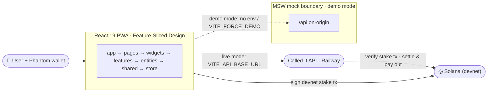

# Called It

Live, on-chain-verified match-prediction PWA for the FIFA World Cup 2026 — you stake real devnet SOL and commit a call **before** the event, and Solana proves you called it first.

## Architecture



The domain is production-shaped (transaction building, wallet signing, settlement predicate). Every network call routes through a single seam (`src/shared/api`); in demo mode MSW intercepts `/api` on-origin, in live mode the same client hits the Railway backend. No UI changes between modes.

**Stack:** Vite · React 19 · TypeScript · Tailwind 4 · shadcn/ui · Zustand · TanStack Query · Zod · MSW. Mobile-first PWA, dark-only "Stadium Pulse" theme (lime `#B6FF3C`, flame `#FF7A18`, charcoal `#0B0F14`; fonts Anybody / Hanken Grotesk / JetBrains Mono). All UI in English, currency in SOL.

## Live vs Demo mode

The mode is resolved from env at first load and then persisted in `localStorage` (`called-it:mode`), so it survives reloads and can be toggled at runtime without a rebuild.

- **Live** — `VITE_API_BASE_URL` is set. The app talks to the real Railway backend and Phantom signs a real devnet SOL transfer to the treasury.
- **Demo** — `VITE_API_BASE_URL` is unset, or `VITE_FORCE_DEMO=true`. MSW serves a full `/api` on-origin, so the app runs standalone with no backend.

## Prediction flow

1. Connect **Phantom** (Solana primary; MetaMask/EVM adapter is ready but secondary). On-chain balance is read live via RPC.
2. Pick a market (goal · card · corner) and a stake in SOL on the live match.
3. Phantom prompts you to **sign a real devnet SOL transfer** to `VITE_TREASURY_ADDRESS` (`signStakeTransfer`), which returns a confirmed tx signature.
4. The prediction is committed with that signature (`POST /predictions`); the backend verifies the stake tx before accepting the call.
5. The client polls the prediction until it settles; the backend settles and pays out on-chain, and streak / profile / leaderboard refresh.

## Environment

Create `.env.local` (all optional — unset falls back to demo mode with devnet defaults):

| Variable                | Purpose                                                                                       |
| ----------------------- | --------------------------------------------------------------------------------------------- |
| `VITE_API_BASE_URL`     | Railway API base, e.g. `https://calledit-api-production.up.railway.app/api`. Set → live mode. |
| `VITE_SOLANA_RPC_URL`   | Solana RPC (default `https://api.devnet.solana.com`).                                         |
| `VITE_TREASURY_ADDRESS` | Devnet treasury that receives stakes — **must equal the backend service-wallet pubkey**.      |
| `VITE_LIVE_MATCH_ID`    | TxLINE fixture the live match tracks.                                                         |
| `VITE_FORCE_DEMO`       | `true` to force demo mode even with an API URL set.                                           |

## Run

```bash
pnpm install
pnpm dev          # http://localhost:5173 — demo mode if no env; live with .env.local
pnpm test         # vitest
```

## Build & deploy

```bash
pnpm build        # tsc -b && vite build → ./out
```

Netlify publishes `out/` (`_redirects` handles SPA deep links). Live at https://called-it.netlify.app.
