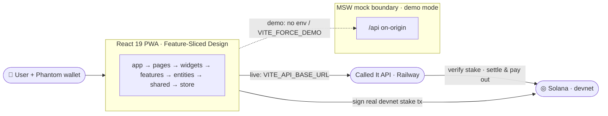

<div align="center">

# CALLED ⚡T

**Call it before it happens — and let Solana prove you called it first.**

A live, on-chain-verified match-prediction PWA for the FIFA World Cup 2026. Stake real devnet SOL and commit a call **before** the whistle; the chain seals the moment.

[](https://solana.com)
[](https://vitejs.dev)
[](https://react.dev)
[](https://web.dev/progressive-web-apps/)

</div>

---

## Architecture



The domain is production-shaped — transaction building, wallet signing, settlement predicate. Every network call routes through a single seam (`src/shared/api`): in demo mode MSW intercepts `/api` on-origin, in live mode the same client hits the Railway backend. **No UI changes between modes.**

## Stadium Pulse

Dark-only, mobile-first identity: lime `#B6FF3C` primary · flame `#FF7A18` accent · charcoal `#0B0F14` background. Type in **Anybody** / **Hanken Grotesk** / **JetBrains Mono**. All UI in English, currency in SOL.

**Stack** — Vite · React 19 · TypeScript · Tailwind 4 · shadcn/ui · Zustand · TanStack Query · Zod · MSW.

## Live vs Demo mode

Mode is resolved from env at first load, then persisted in `localStorage` (`called-it:mode`), so it survives reloads and toggles at runtime with no rebuild (`isDemo()`).

| Mode     | When                                 | Behavior                                                                                     |
| -------- | ------------------------------------ | -------------------------------------------------------------------------------------------- |
| **Live** | `VITE_API_BASE_URL` is set           | Talks to the real Railway backend; Phantom signs a real devnet SOL transfer to the treasury. |
| **Demo** | env unset, or `VITE_FORCE_DEMO=true` | MSW serves a full `/api` on-origin — runs standalone, no backend.                            |

## Prediction flow

1. Connect **Phantom** on devnet (Solana primary; MetaMask/EVM adapter ready but secondary). Balance is read live via RPC.
2. See the live match; pick a market — **goal · corner · card** — and a fractional stake in SOL.
3. Phantom prompts you to **sign a real devnet SOL transfer** to `VITE_TREASURY_ADDRESS` (`signStakeTransfer`), returning a confirmed tx signature.
4. The call is committed with that signature (`POST /predictions`); the backend **verifies the stake tx on-chain** before accepting it.
5. The client polls until the market settles — the backend settles and pays out on-chain, then streak / profile / leaderboard refresh.

## Environment

Create `.env.local` — all optional; unset falls back to demo mode with devnet defaults.

| Variable                | Purpose                                                                                       |
| ----------------------- | --------------------------------------------------------------------------------------------- |
| `VITE_API_BASE_URL`     | Railway API base, e.g. `https://calledit-api-production.up.railway.app/api`. Set → live mode. |
| `VITE_SOLANA_RPC_URL`   | Solana RPC (default `https://api.devnet.solana.com`).                                         |
| `VITE_TREASURY_ADDRESS` | Devnet treasury that receives stakes — **must equal the backend service-wallet pubkey**.      |
| `VITE_LIVE_MATCH_ID`    | TxLINE fixture the live match tracks.                                                         |
| `VITE_FORCE_DEMO`       | `true` to force demo mode even with an API URL set.                                           |

## Run & build

```bash
pnpm install
pnpm dev          # http://localhost:5173 — demo if no env; live with .env.local
pnpm build        # production build
pnpm test         # vitest
```

Live at **https://called-it.netlify.app** — deployed on Netlify from `master`.
